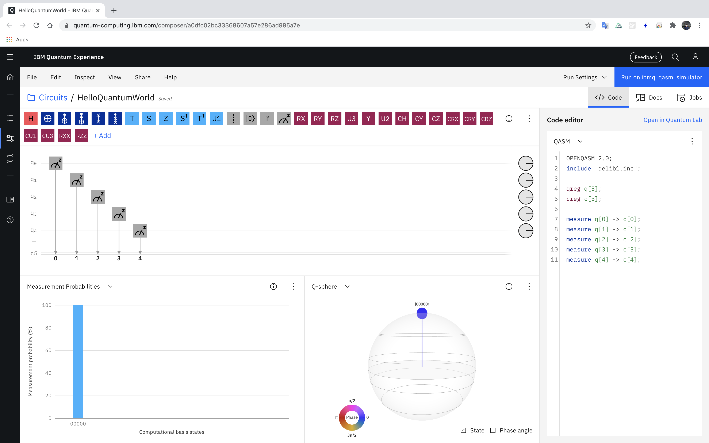
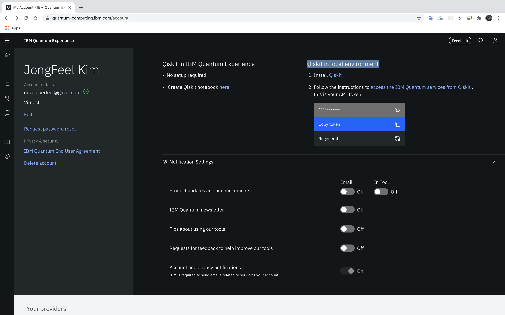

# Chapter01

## IBM QX setup

책에 있는대로 IBM QX(Quantum Experience) 사이트에서 계정을 생성하고 Composer를 실행해 본다. 현 시점에서는 Circuit Composer라는 이름의 메뉴로 되어 있다.



책의 스크린샷과 다른 점은 아래와 같다.

- Gates 배치가 우측이 아닌 상단에 있다.
- 최초 qubit 개수는 3개여서 composer 상에 + 버튼을 눌러 qubit 2개를 더 추가해야 5 qubit test가 가능하다.
- QASM 및 Qiskit 코드가 자동 생성되며 composer와 동기화가 되므로 visual coding이 가능하다.
- Histogram 외에 Q-sphere가 추가되서 더 직관적으로 시각화가 가능하다.
- 처음에 backend가 simulator로 되어 있지 않으므로 backend 세팅을 바꾼 후에 진행해야 한다.

### API 키

책은 스크린샷 없이 글로 설명되어 있는데 우측 상단의 my account를 눌러보면 바로 아래와 같은 화면이 나오고 다른 메뉴를 찾아 헤메일 필요 없이 Qiskit in local environment 항목에서 바로 API token을 확인할 수 있다.



### Qiskit 예제 설정과 실행

책이 출판된 시점과 현재 시점에서의 qiskit의 버전은 꽤 다르므로 사실 그대로 실행이 되지 않는다. 이건 현 시점에서 qiskit 0.23.0 기준의 설명이다.

특별히 책에 있는 내용대로 동작하지 않는 부분에 대해 수정된 점만 설명한다.

jupyter notebook의 update는 

https://github.com/PacktPublishing/Mastering-Quantum-Computing-with-IBM-QX

이 주소에서 fork 해온 나의 repository인

https://github.com/jongfeel/Mastering-Quantum-Computing-with-IBM-QX

여기에서 확인 가능하다.

Chapter01의 부분만 확인해 보고자 하면 아래 링크를 참고하자.

https://github.com/jongfeel/Mastering-Quantum-Computing-with-IBM-QX/blob/master/Chapter01/Hello%20Quantum%20World.ipynb

#### Jupyter notebook troubleshooting

 :warning: jupyter notebook 환경 설정이 잘 안되면 가상 환경 커널에서 에러가 많이 발생한다. 대부분 패키지 설정에서 오류가 나는데 uninstall 해주고 다시 install 해주면 거짓말 같이 동작한다.

나의 경우는 numpy, pywin32, Pillow 등의 패키지를 재설치 해줬다.

#### 차이점

IBMQ.backends() 함수가 동작하지 않는다.
검색해 보면 아래와 같은 링크를 찾을 수 있고 해결할 수 있다.

https://quantumcomputing.stackexchange.com/questions/9161/how-to-fix-an-error-attributeerror-ibmqfactory-object-has-no-attribute-get

IBMQ에서 바로 호출하는 형태가 아니라 provider에서 backend를 얻는 형태로 진행해야 한다. backends()와 get_backend() 함수를 사용할 수 있다.

``` python
provider = IBMQ.get_provider()
print(provider.backends())
backend  = provider.get_backend('ibmq_qasm_simulator')
```

