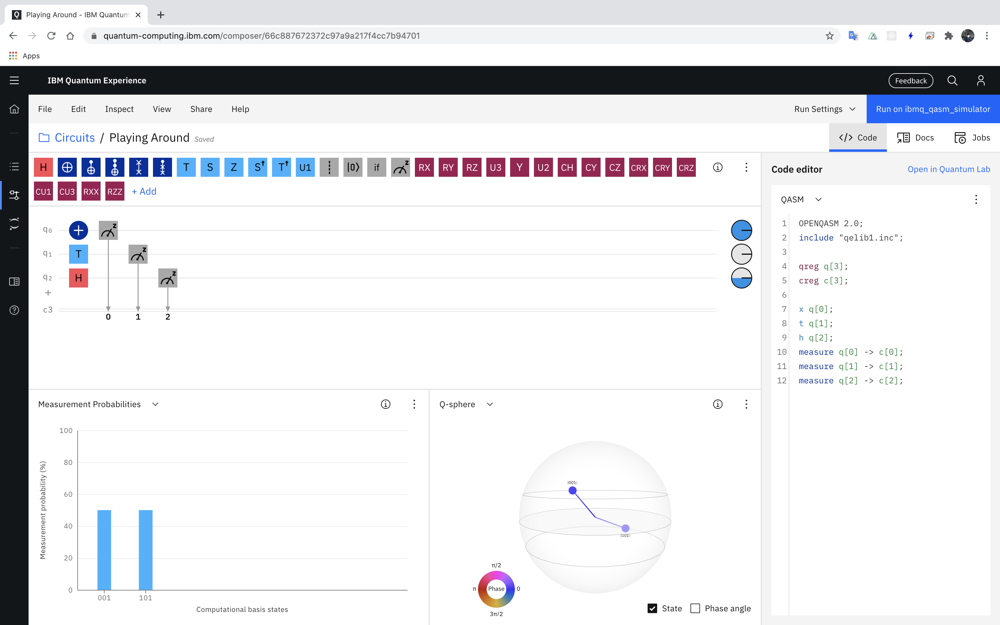
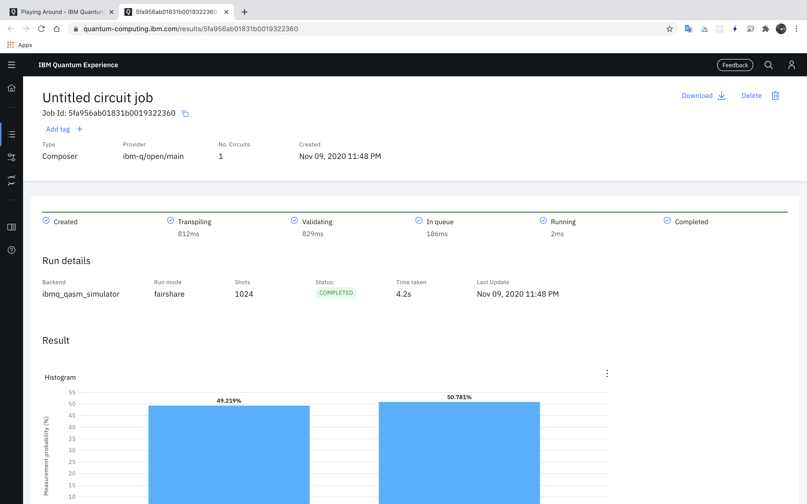
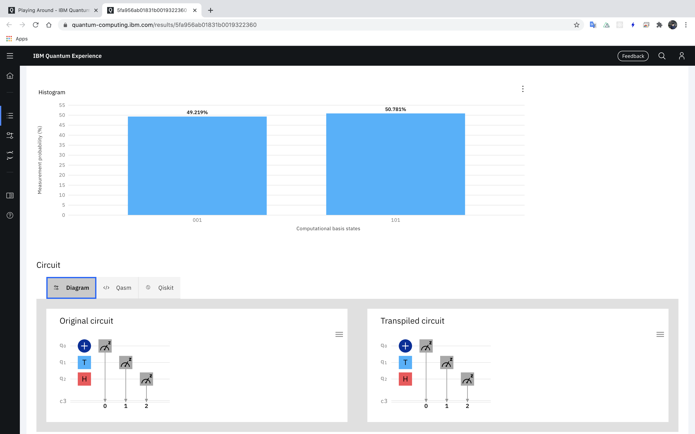
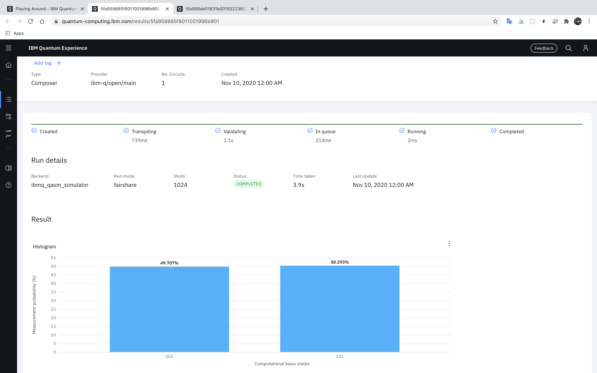
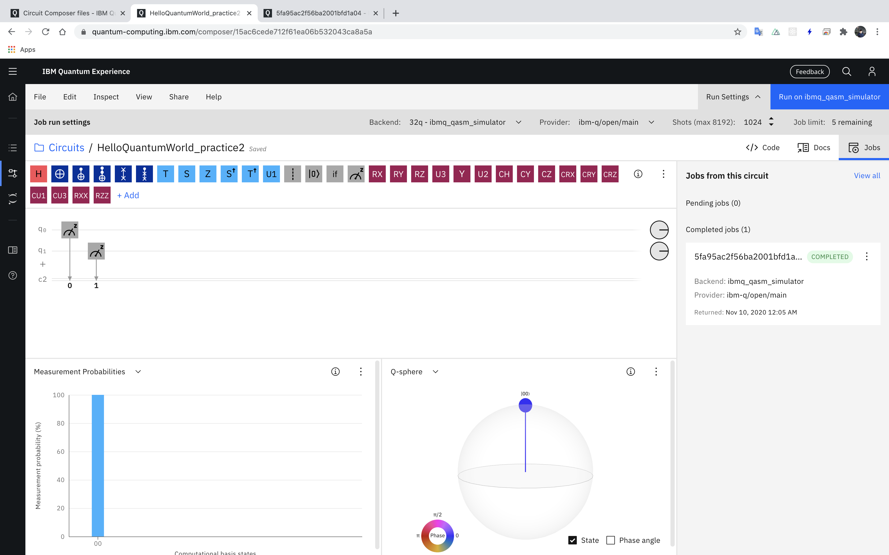
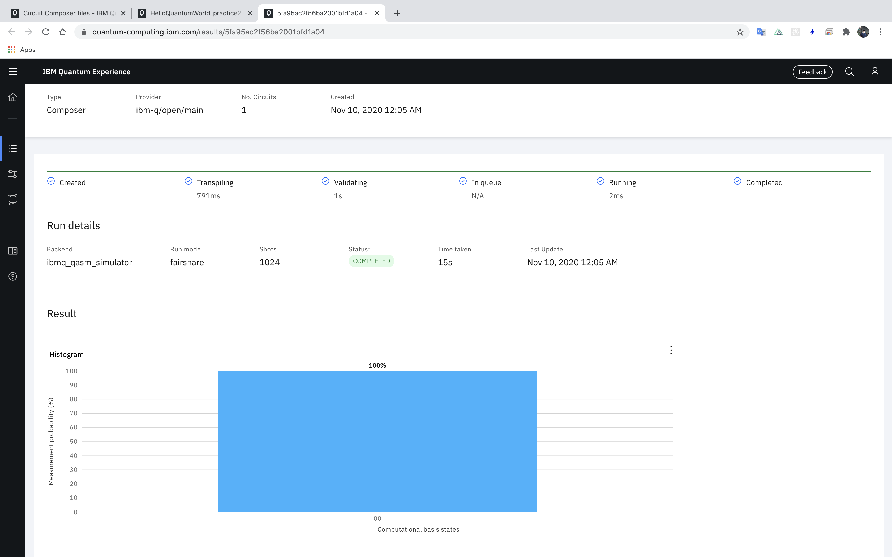
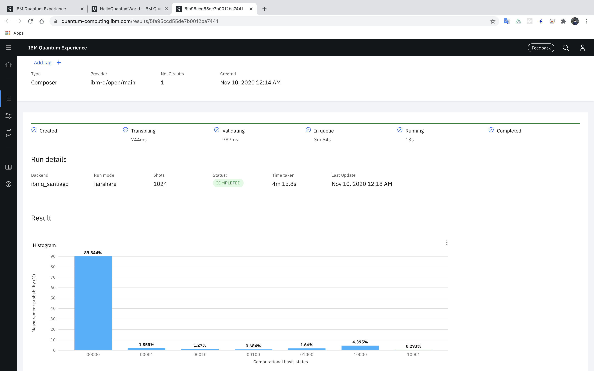

# Chapter01 practice

출처: 크리스틴 콜벳 모란, *IBM QX로 배우는 양자 컴퓨팅: 양자 컴포저와 키스킷을 활용한 양자 컴퓨팅의 이해*, 황진호, (서울: 에이콘출판주식회사, 2020), 44.

출판사의 요청에 따라 출처를 밝힌 후에 연습문제 및 풀이를 올려본다.

## 연습문제

1. Playing Around라는 새로운 양자 스코어를 만들고, 사용자 화면에서 몇 개의 상자를 선으로 드래그합니다. 그리고 각 선에 대해 측정 상자를 추가하고, Simulate(시뮬레이션)를 클릭합니다. 어떤 결과가 나옵니까?

2. 첫 번째 양자 프로그램에서 큐비트와 전통적인 비트의 수를 5에서 2로 변경하세요. 이를 실행한 결과는 어떠합니까?

3. 첫 번째 양자 프로그램을 시뮬레이션이 아닌 실제 양자 컴퓨터에서 구동해보세요. 이는 양자 컴포저 사용자 인터페이스나 키스킷에서 가능합니다. 양자 컴퓨터 사용자 인터페이스에서는 'Hello quantum world' 절에서 한 것과 동일합니다. 이번에는 Simulate 대신 Run을 클릭하세요. 키스킷에서는 후위 처리 장치를 ibmq_5_로 시작하는 옵션을 선택하고, Run을 실행하세요. 두 경우 모두 더 많은 시간이 소요될 것입니다. 결과는 어떠합니까? 실제로 구동하는 것이 시뮬레이션과 다른 이유는 뭐라고 생각하세요?

4. 큐비트를 0과 1 중간쯤에 두고 싶다면, 큐비트를 가시화할 때 사용하는 구의 어디쯤에 위치하는게 맞습니까?

## 풀이

### Checkout Quantum Experience

책에 스크린샷은 현재 IBM Quantum Experience와 다른데 다른 점을 적어 보면

- 책: Run 버튼과 Simulate 버튼이 별도로 존재
- IBM QE(Quantum Experience): Run on xxx버튼 하나로 되어 있는데 기본적으로 backend가 `32q - ibmq_qasm_simulator`로 설정되어 있다.
  - 즉, 이 상태에서 Run on 32q - ibmq_qasm_simulator를 클릭하면 시뮬레이션 하는 것으로 수초 이내애 결과가 나온다.
  - 반대로 다른 backend를 선택하면 실제 (아마 클라우드 상에 존재하는)양자 컴퓨터를 실행하는 것으로 네이밍이 지역 이름으로 되어 있으며 job batching도 최대 5회로 제한되어 있다.

### 1번 문제

- Playing Around 양자 스코어 생성 후 몇 개의 상자를 선으로 드래그, 각 선에 대해 측정 상자 추가
  - 무작위로 X gate, T gate, Hadamard gate를 배치
  - 각 큐비트별로 Measurement 배치  
  - 
- Simualte 클릭, 여기서는 우측 상단의 파란 버튼인 `Run on ibmq_qasm_simulator`를 클릭
- 실행 결과는 아래와 같다. 스크롤 화면이어서 스크린샷을 두장으로 찍음
  - 
  - 
- 결과 분석
  - 실행 하기 전에는 state 001, state 101이 각 50%로 동일한 확률의 가능성을 제시해 준다.
  - Simulator 실행 후 state 결과 자체는 달라지지 않지만 확률이 미세하게 차이가 난다.
  - State 001의 경우 49.219%, State 101의 경우 50.781% 이다.
  - 큐비트의 측정 결과는 항상 같지 않을 것이므로 계속 simulation을 해보면 미세한 차이가 나는 결과를 얻게 될 것이다.
  - 실제 다시 측정한 결과 state 001: 49.707%, state 101: 50.293% 이다.
  - 

### 2번 문제

- HelloQuantumWorld에서 큐비트를 2개로 만든 HelloQuantumWorld_practice2를 생성하고 실제 큐비트 2개를 배치한다.
- 비트수를 5에서 2로 변경하고 그대로 측정하면 당연하게도 state 00으로 100%의 결과를 얻게 된다.
  - 
  - 
- 결과 분석
  - 어쨌든 큐비트에 게이트를 배치하지 않는 이상 큐비트와 전통적인 비트수에 상관 없이 항상 state는 비트수만큼 100%로 측정된다.

### 3번 문제

- HelloQuantumWorld에서 backend를 `5q - ibmq_santiago`를 선택한다.
- Run on 5q - ibmq_satiago 버튼을 클릭하면 실제 양자 컴퓨터에서 실행되고 예상 대기 시간이 10분으로 나오는데 실제 5분 이내로 결과가 나온다.
- 실제 결과를 보면 당황하게 되는데 시뮬레이션에서 state 00000이 100%로 예측했고 실제 시뮬레이터를 돌려봐도 state 00000이 100%인데 비해
- 5q - ibmq_satiago로 돌려보면 아래 스크린샷과 같이 다채로운 state와 그에 따른 확률 값이 분포되어 나온다
- 
- 중요한건 state 00000이 100%는 아니더라도 다른 state에 비해 100%에 근접한 값을 얻는다는 것이 시뮬레이터로 돌린 결과와 다른 것이라고 볼 수 있다.

## 4번 문제

- IBM Quantum Experience의 Quantum Composer에서 보여주는 Q-sphere는 항상 구의 위쪽이 |0>을 나타내고 있다.
- 그러므로 |1>이라면 구의 아래쪽을 향하고 있어야 qubit의 state 1이 100% 확률이 되는데
- 양자 컴퓨터 책을 보다 보면 이 두 상태가 동시에 존재하는 특징을 갖는게 qubit이므로
- |0> + |1> 이 동시에 측정될 수 있고 특별한 게이트를 쓴다면 50%씩의 확률을 가지게 될 것이다.
  - 아마 Hadamard 게이트일 것이다.
- 따라서 구의 상단에 하나 하단에 하나 해서 구를 관통하는 모양으로 만든다면 qubit의 0과 1 어디쯤을 표현할 수 있을 것이다.